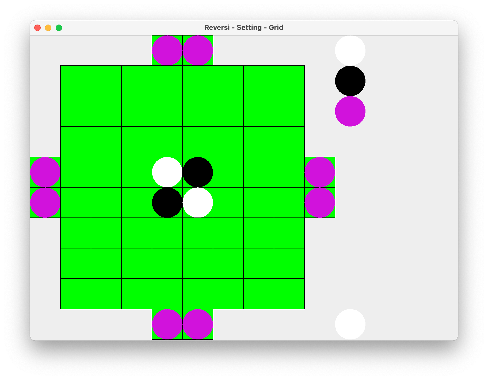
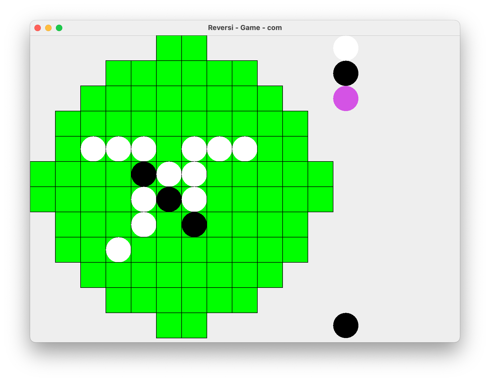
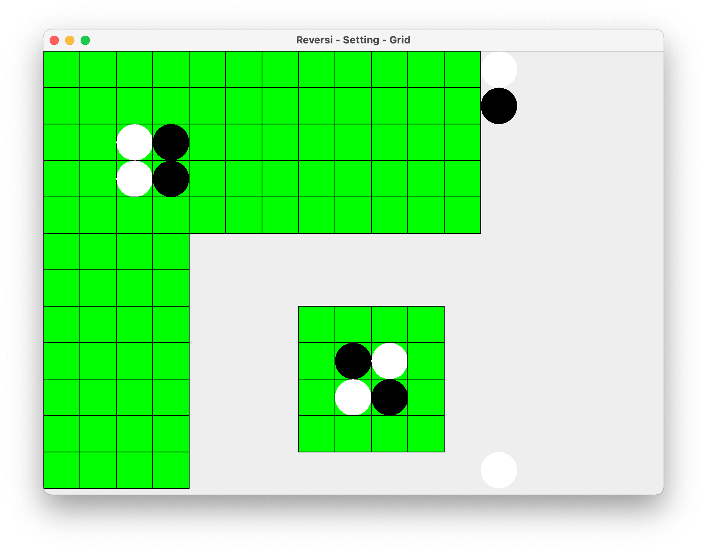
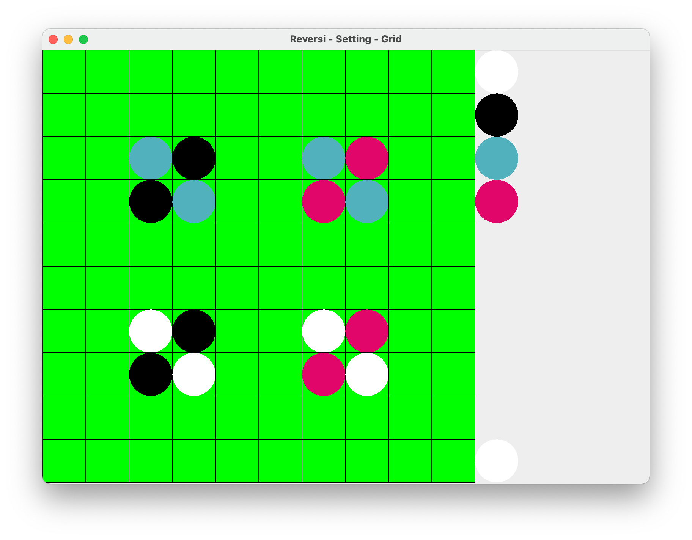

# Reversi

### Webアプリケーション版
URL:https://free-reversi-app.herokuapp.com/  
サーブレット/JSPを勉強しながら開発中です。  
Web版での開発環境や、詳細はGitに載せています。  
現在、8×8以外のテーブルでゲームをすると、バグが発生します。  
Github:https://github.com/chiroro-ku/Free-Reversi  

# アプリケーション名：Non-Reversi
白の反対が黒とは限らない。表の反転が裏ではない。リバーシはリバーシでも反転しない。  
以上のような事を考えて名前をつけました。

# アプリケーション説明
凸凹や虫食いのようなテーブル、巨大なテーブルを作ることができ、2人以上のプレイヤーで、ゲームすることができるリバーシです。  
コンピューターも設定することができ、Mobプレイヤー（弱いプレイヤー（初期状態から駒の数が少ない、不利な場所に駒がある））を作り、1vs1だけでなく、1vs2（プレイヤーと対等なCPU+Mobプレイヤーが1人）のリバーシを遊ぶことができます。  

# 目次
1. [魅力](#anchor1)
2. [開発・設計](#anchor2)
3. [工夫点・改善点](#anchor3)
4. [説明](#anchor4)

# 魅力
現時点では、このアプリケーションは「面白く無い」と思っています。  
原因は、UIが悪く使いにくい点と、コンピュータが弱い事だと考えています。  
しかし、「リバーシ」が本来持つ面白さや、美しさを向上させることは、できたと思います。  
プレイヤー人数の増加から、先の手を読む難易度の上昇や、盤面が変化することによる、定石の変化（角は角でも、”強い角”と”弱い角”がある。”配置できると有利であるマス目”の変化）がこのアプリケーションの魅力・面白さであると考えています。  
また、ゲームが終了した時のカラフルな盤面も、面白さの一つだと考えています。

# 開発・設計

## 開発環境
開発言語：Java言語  
使用ツール：Visual Studio Coode  
形式：アプリケーション

## 開発目的
- 新しいオセロシステムの開発   
- Java言語の学習  
- ソフトウェア開発の実践

## 開発方針
オブジェクト指向分析設計での開発、アーキテクチャはMVCモデルを目指しました。  
自由なテーブル、自由なプレイヤー人数でゲームできるリバーシシステム。

## クラス図

# 工夫点・改善点

## 工夫した点
ソースを作成するだけだでく、実践的なソフトウェア開発を目指したことです。    
クラス図の作成、MVCモデルでの開発、buildファイルでのコンパイル、アプリケーション形式でのエクスポート、適切なコメント文やJavadocの作成、Gitでのバージョン管理等を挑戦してみました。  
実際にツールやシステムを扱うのは難しかったのですが、少し慣れると作業効率が上昇しました。  
もう一つは、オブジェクト指向分析設計を実践したことです。
まず、「リバーシ」にどのようなオブジェクトがあるかを考えました。  
次に、それぞれのオブジェクトが、どのような振る舞いをしているかを分析して、クラス図を作成しました。  
作成したクラス図を基に、コーディングしました。  
駒クラスが自分自身の数を掌握することで、「盤面全体を探索しない駒のカウント機能」を作ることができました。  
また、グリッドは、周囲の隣のグリッドを掌握していて、双方向リストのようになっています。  
これにより、駒の反転で、隣の駒から隣の駒の情報を、再帰呼び出しで読み込み、簡略化することができました。

## 改善点
改善点としてはまず、コンピューターの強化です。  
現在のコンピューターは「一手先読み」で、盤面の評価関数は「反転できる駒が多い手」です。  
対戦してみると、それほど強く無いです。  
コンピューターの強化の方法として考えているのは、min-max法を利用した、「n手先読み」です。  
もう一つは、グリッドの活用です。  
現在、「駒を配置できるグリッドが1つ以上あるか」という計算は、テーブルの全グリッドを探索しています。  
この処理を、グリッドそれぞれが、自動的に計算できるようにしたい、と考えています。  
ほかに、グリッドと駒クラスを活用して、「このグリッドには、白い駒も黒い駒も赤い駒もある」のような、実装を考えています。  
この機能を使って、コンピュターで先読みする時の、仮想のテーブルでの計算を効率化できないかと考えています。
最後の改善点は、テスト作業を効率的に行えていなかったことです。  
まず、要件定義をして、それに合わせたテストを作る。  
そして、設計を始めるべきだったと思います。  

## 学んだ事
学習と実践が目的だったとこから、学んだ事と感想もまとめます。  
コーディングは、開発にある様々な作業の、一つの作業でしか無いと思いました。  
設計をすることで、オブジェクト指向に遵守して、効率的にコーディングできました。  
しかし、要件分析と要件定義不足から、設計をやり直すことになりました。  
また、テスト作業を効率的に行うことができませんでした。  
この反省点と、実践した経験から、ソフトウェア開発の視野が広がりました。  
感想としては、コーディング以外の作業も極めたいと思いました。  
また、一からソフトウェアを開発することで、高い達成感と、自分の能力が大きく成長した感覚を得ることができました。  

# 説明

## 起動方法
Reversi.appの実行。

## 操作方法
1. テーブルの設定  
まず、フレームタイトルが「Reversi - Table - Setting」になっている事を確認してください。  
四角で囲われているのが「グリッド」で、緑のグリッドで展開されているのが「テーブル」です。  
テーブルを大きくしたい時は、テーブル内をクリックしてください。  
テーブルの大きさを決定したい時は、テーブル外をクリックしてください。  
この時、フレームタイトルが「Reversi - Player - Setting」になっている事を確認してください。  

2. プレイヤー設定  
テーブル外の右上にある駒が、プレイヤーと、そのプレイヤーの駒の色を示しています。  
プレイヤーの名前は上から順に１、２・・・と設定されています。
プレイヤーを追加したい時は、テーブル内をクリックしてください。  
プレイヤーの人数を決定したい時は、テーブル外をクリックしてください。  
この時、フレームタイトルが「Reversi - Grid - Setting」になっている事を確認してください。  

3. グリッド設定  
緑のグリッドは、駒を配置することができるグリッドです。  
白のグリッドは、壁を表していて、駒を配置できません。  
各グリッドをクリックする事で、初期設定を変更できます。  
緑　→壁　→（プレイヤー１の駒　→プレイヤー２の駒　→プレイヤー３の駒　→・・・）　→緑　→壁・・・  
上記の順で設定は変更されます。  
グリッドの設定を決定したい時は、テーブル外をクリックしてください。  
この時、フレームタイトルが「Reversi - Game - 1」になっている事を確認してください。  

4. ゲーム  
フレームタイトルに現在の手番のプレイヤーの名前と、  
そのプレイヤーの駒が、テーブル外の右下に表示されます。  
グリッドをクリックする事で、駒を配置できます。  
手番のプレイヤーが、どこにも駒を配置できない時は、自動的に手番がパスされます。  
テーブル外をクリックする事で、手動でパスすることもできます。  
緑のグリッド全てに、駒が配置されるとゲームが終了します。  
また、全てのプレイヤーが、自動的にパスされた時も、ゲームは終了します。  
この時、フレームタイトルが「Reversi - Game - Win - 」になっていることを確認してください。  
「Win」の後に、勝利したプレイヤーの名前と、  
テーブル外の右下に、そのプレイヤーの駒が表示されます。
もう一度ゲームしたい時は、テーブル外をクリックすることで、リスタートすることができます。   
