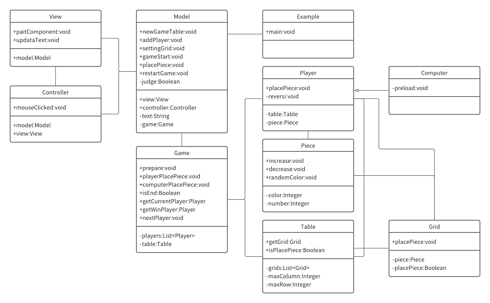

# Reversi

### Webアプリケーション版
URL:https://free-reversi-app.herokuapp.com/  
サーブレット/JSPを勉強しながら開発中です。  
Web版での開発環境や、詳細はGitに載せています。  
現在、8×8以外のテーブルでゲームをすると、バグが発生します。
Github:https://github.com/chiroro-ku/Free-Reversi  

# アプリ名：Non-Reversi
白の反対が黒とは限らない。表の反転が裏ではない。リバーシはリバーシでも反転しない。  
以上のような事を考えて名前をつけました。

# アプリケーション説明
凸凹や虫食いのようなテーブル、巨大なテーブルを作ることができ、2人以上のプレイヤーで、  
ゲームすることができるリバーシです。コンピューターも設定することができ、  
Mobプレイヤー（弱いプレイヤー（初期状態から駒の数が少ない、不利な場所に駒がある））を作り、  
1vs1だけでなく、1vs3（プレイヤーと対等なCPU+Mobプレイヤーが2人）のリバーシを遊ぶことができる。

## 開発環境
開発言語：Java言語  
使用ツール：Visual Studio Coode  
形式：アプリケーション

# 開発目的
・新しいオセロシステムの開発  
・「マリオメーカー」「RPGツクール」等のツールゲームの提案    
・Java言語の学習  
・ソフトウェア開発の実践

## 開発方針
オブジェクト指向分析設計での開発、アーキテクチャはMVCモデルを目指しました。  
自由なテーブル、自由なプレイヤー人数でゲームできるリバーシシステム。

## クラス図

## 工夫した点

# アプリケーション説明

## 起動方法
Reversi.appの実行。

## 操作方法
1. テーブルの設定  
まず、フレームタイトルが「Reversi - Table - Setting」になっている事を確認してください。  
四角で囲われているのが「グリッド」で、緑のグリッドで展開されているのが「テーブル」です。  
テーブルを大きくしたい時は、テーブル内をクリックしてください。  
テーブルの大きさを決定したい時は、テーブル外をクリックしてください。  
この時、フレームタイトルが「Reversi - Player - Setting」になっている事を確認してください。  

2. プレイヤー設定  
テーブル外の右上にある駒が、プレイヤーと、そのプレイヤーの駒の色を示しています。  
プレイヤーの名前は上から順に１、２・・・と設定されています。
プレイヤーを追加したい時は、テーブル内をクリックしてください。  
プレイヤーの人数を決定したい時は、テーブル外をクリックしてください。  
この時、フレームタイトルが「Reversi - Grid - Setting」になっている事を確認してください。  

3. グリッド設定  
緑のグリッドは、駒を配置することができるグリッドです。  
白のグリッドは、壁を表していて、駒を配置できません。  
各グリッドをクリックする事で、初期設定を変更できます。  
緑　→壁　→（プレイヤー１の駒　→プレイヤー２の駒　→プレイヤー３の駒　→・・・）　→緑　→壁・・・  
上記の順で設定は変更されます。  
グリッドの設定を決定したい時は、テーブル外をクリックしてください。  
この時、フレームタイトルが「Reversi - Game - 1」になっている事を確認してください。  

4. ゲーム  
フレームタイトルに現在の手番のプレイヤーの名前と、  
そのプレイヤーの駒が、テーブル外の右下に表示されます。  
グリッドをクリックする事で、駒を配置できます。  
手番のプレイヤーが、どこにも駒を配置できない時は、自動的に手番がパスされます。  
テーブル外をクリックする事で、手動でパスすることもできます。  
緑のグリッド全てに、駒が配置されるとゲームが終了します。  
また、全てのプレイヤーが、自動的にパスされた時も、ゲームは終了します。  
この時、フレームタイトルが「Reversi - Game - Win - 」になっていることを確認してください。  
「Win」の後に、勝利したプレイヤーの名前と、  
テーブル外の右下に、そのプレイヤーの駒が表示されます。  
